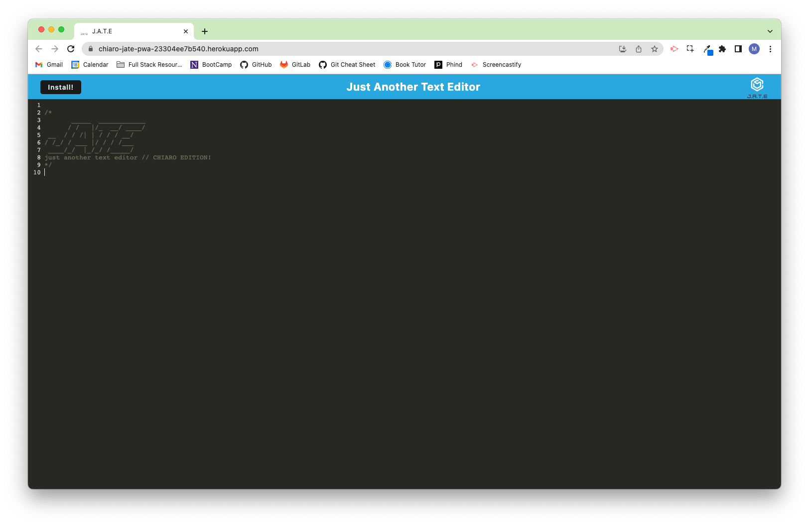
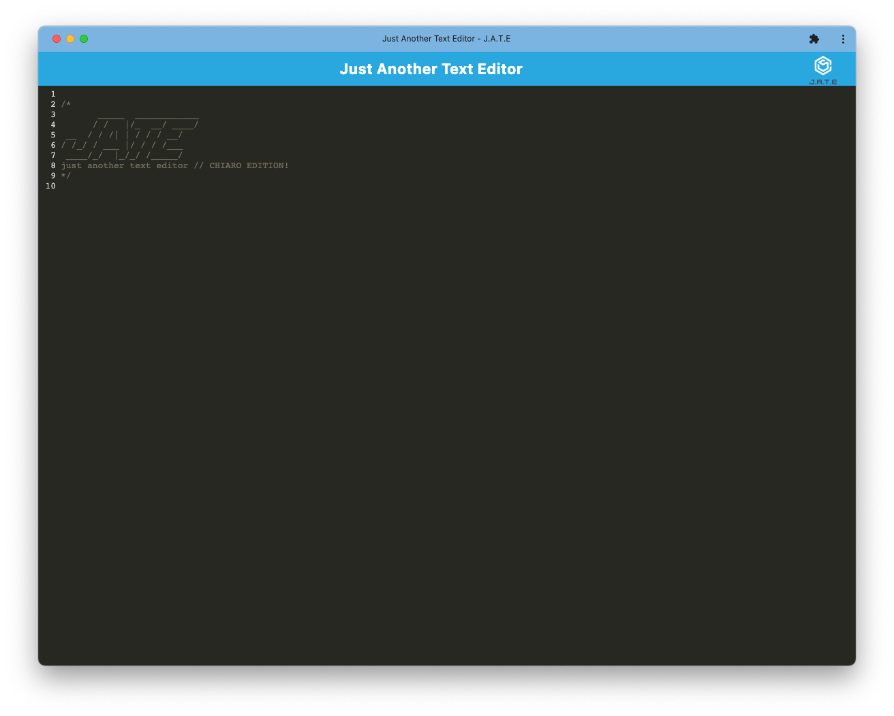

# pwa-text-editor

## Description

The purpose of this application was to create a functioning PWA with multiple forms of storage for your data. 

The application exists as a text editor that runs in the browser. Data entered into the editor will be stored within indexedDB, and will be available to the user even when offline. When the user comes back online, the data will be synced to the server. As a backup, the data will also be stored in local storage.

Since it is a PWA, the application can be downloaded and exists as a standalone application on your device. It functions the same offline as it does online.

## Installation

To install, clone the repo or download it as a .zip file. Upon downloading, `npm i` within the root folder will install all necessary dependencies. `npm start` will build the application and start the server. The application will be available at `localhost:3001`.

## Usage

Project is fully deployed [here.](https://chiaro-jate-pwa-23304ee7b540.herokuapp.com/). 

To download the offline version, simply click the `install` button in the top left corner of the application. 

## License

